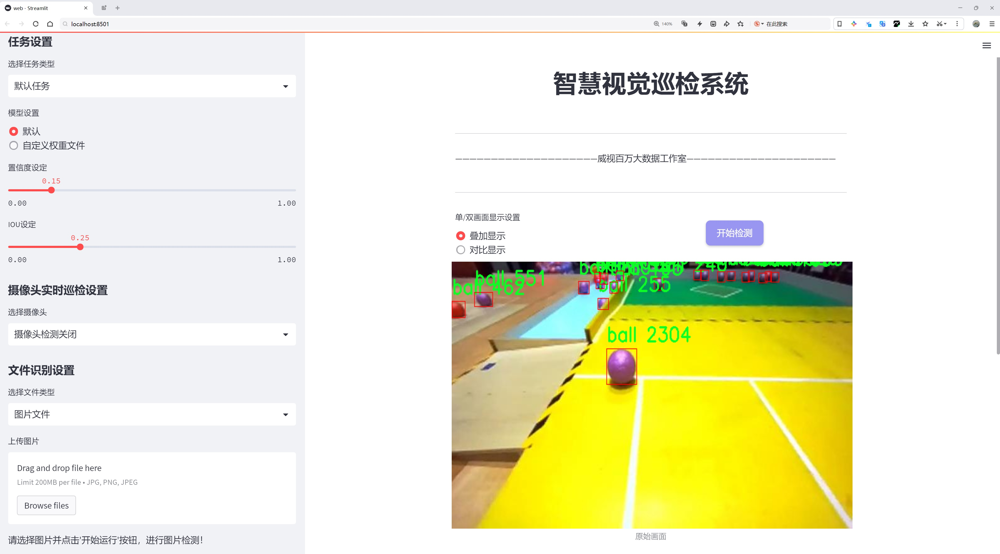
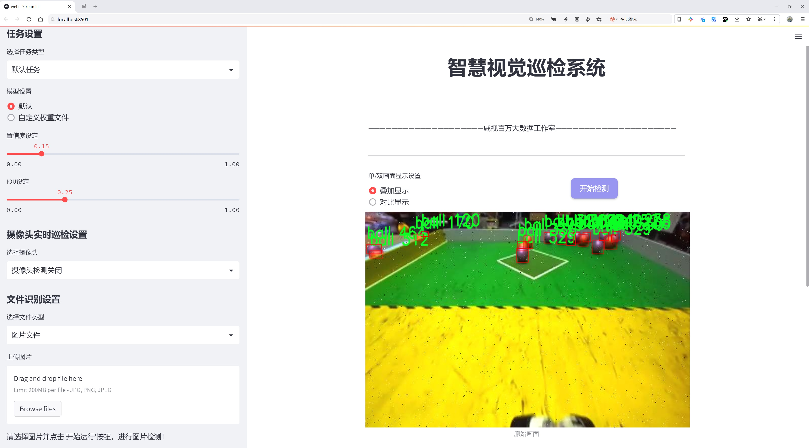
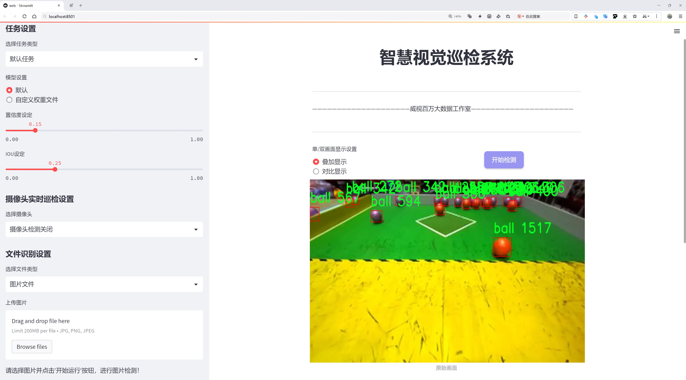
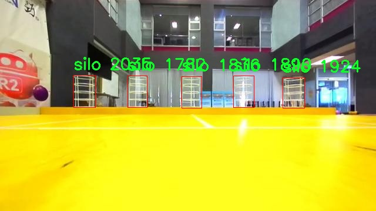
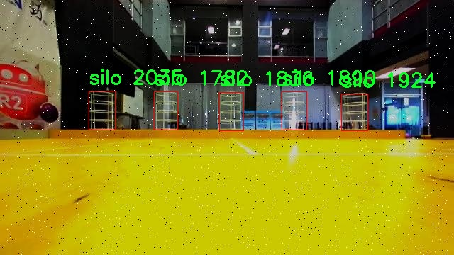
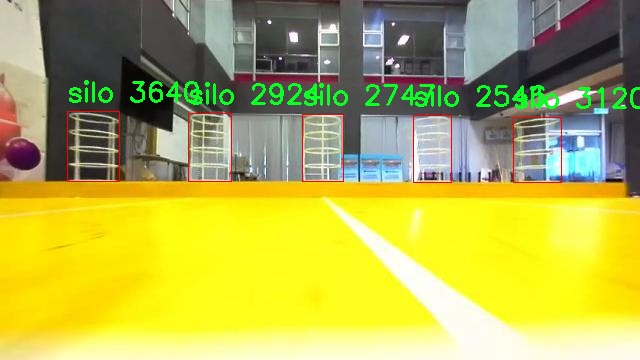

# 球体检测检测系统源码分享
 # [一条龙教学YOLOV8标注好的数据集一键训练_70+全套改进创新点发刊_Web前端展示]

### 1.研究背景与意义

项目参考[AAAI Association for the Advancement of Artificial Intelligence](https://gitee.com/qunmasj/projects)

项目来源[AACV Association for the Advancement of Computer Vision](https://kdocs.cn/l/cszuIiCKVNis)

研究背景与意义

随着计算机视觉技术的迅猛发展，物体检测作为其核心任务之一，已经在多个领域得到了广泛应用，如自动驾驶、安防监控、智能制造等。YOLO（You Only Look Once）系列模型因其高效的实时检测能力和良好的准确性，成为了物体检测领域的热门选择。特别是YOLOv8的推出，进一步提升了检测精度和速度，为复杂场景下的物体识别提供了新的解决方案。然而，尽管YOLOv8在多种应用中表现出色，但在特定场景和目标物体的检测上仍存在一定的局限性，尤其是在多类别目标的识别和定位精度方面。因此，基于改进YOLOv8的球体检测系统的研究显得尤为重要。

本研究的主要目标是通过对YOLOv8模型的改进，提升其在球体检测任务中的性能。我们选取了Robocon 2024数据集，该数据集包含3939张图像，涵盖了四个类别：蓝色、紫色、红色和筒仓。这些类别的选择不仅丰富了检测任务的多样性，也为模型的训练和评估提供了良好的基础。球体作为一种常见的物体，其在运动、游戏、工业等多个领域都有着广泛的应用，准确检测和识别球体对于实现智能化管理和控制具有重要意义。

通过对YOLOv8模型的改进，我们将重点关注以下几个方面：首先，优化特征提取网络，以提高对球体的细节捕捉能力；其次，调整锚框设置，以更好地适应不同尺寸和形状的球体；最后，结合数据增强技术，提升模型的泛化能力和鲁棒性。这些改进措施旨在提升模型在复杂背景下对球体的检测精度，降低误检和漏检的概率，从而实现更为可靠的检测结果。

本研究的意义不仅在于提升YOLOv8在球体检测任务中的性能，更在于为后续的研究提供借鉴。通过对模型的改进和优化，我们希望能够为其他物体检测任务提供新的思路和方法。此外，随着数据集的不断扩展和丰富，未来的研究还可以进一步探索多类别物体的联合检测、实时检测系统的构建等方向，推动计算机视觉技术的不断进步。

综上所述，基于改进YOLOv8的球体检测系统的研究，既是对现有技术的深化和拓展，也是对实际应用需求的积极响应。通过本研究，我们期望能够为物体检测领域的发展贡献一份力量，同时为相关应用场景的智能化发展提供技术支持。

### 2.图片演示







##### 注意：由于此博客编辑较早，上面“2.图片演示”和“3.视频演示”展示的系统图片或者视频可能为老版本，新版本在老版本的基础上升级如下：（实际效果以升级的新版本为准）

  （1）适配了YOLOV8的“目标检测”模型和“实例分割”模型，通过加载相应的权重（.pt）文件即可自适应加载模型。

  （2）支持“图片识别”、“视频识别”、“摄像头实时识别”三种识别模式。

  （3）支持“图片识别”、“视频识别”、“摄像头实时识别”三种识别结果保存导出，解决手动导出（容易卡顿出现爆内存）存在的问题，识别完自动保存结果并导出到tempDir中。

  （4）支持Web前端系统中的标题、背景图等自定义修改，后面提供修改教程。

  另外本项目提供训练的数据集和训练教程,暂不提供权重文件（best.pt）,需要您按照教程进行训练后实现图片演示和Web前端界面演示的效果。

### 3.视频演示

[3.1 视频演示](https://www.bilibili.com/video/BV1WXs8ejEhG/)

### 4.数据集信息展示

##### 4.1 本项目数据集详细数据（类别数＆类别名）

nc: 2
names: ['ball', 'silo']


##### 4.2 本项目数据集信息介绍

数据集信息展示

在本研究中，我们使用了名为“Robocon 2024”的数据集，以支持对YOLOv8模型的改进，专注于球体检测系统的训练和优化。该数据集包含了丰富的图像数据，旨在提升模型在特定场景下的检测精度和效率。数据集的类别数量为2，具体类别包括“ball”（球体）和“silo”（筒仓），这两个类别的选择不仅反映了实际应用中的重要性，也为模型的训练提供了多样化的目标检测任务。

“Robocon 2024”数据集的构建考虑到了多种环境和条件，以确保模型在不同场景下的鲁棒性。数据集中包含的图像来源于多个实际场景，涵盖了室内和室外的不同光照条件、背景复杂度以及视角变化。这种多样性使得模型在训练过程中能够学习到更为全面的特征，从而提高其在实际应用中的适应能力。例如，球体在不同背景下的表现可能会受到光照、颜色和形状的影响，而筒仓则可能因为其结构特征而在视觉上与其他物体产生混淆。因此，数据集的设计旨在最大限度地减少这些潜在的干扰因素，以提升模型的检测准确性。

在数据集的标注过程中，采用了高精度的标注工具，确保每个图像中的目标都得到了准确的框选和分类。标注人员经过严格的培训，能够识别出不同类别的特征，确保数据集的质量和可靠性。通过这种方式，数据集不仅为模型提供了大量的训练样本，还为后续的验证和测试阶段奠定了坚实的基础。

此外，数据集还包含了丰富的元数据，包括图像的拍摄时间、地点、环境条件等信息。这些元数据为后续的分析和模型调优提供了重要的参考依据，使研究人员能够更深入地理解模型在不同条件下的表现。通过对数据集的全面分析，研究人员可以识别出模型在特定场景下的弱点，从而进行针对性的改进。

在模型训练过程中，采用了数据增强技术，以进一步提升模型的泛化能力。通过对“Robocon 2024”数据集中的图像进行旋转、缩放、裁剪等操作，研究人员能够生成更多的训练样本，增强模型对各种变换的适应能力。这种方法不仅提高了模型的训练效率，还在一定程度上缓解了过拟合的问题。

总之，“Robocon 2024”数据集为改进YOLOv8的球体检测系统提供了坚实的基础。通过多样化的图像数据、精准的标注和丰富的元数据，研究人员能够有效地训练和优化模型，以实现更高的检测精度和更强的适应能力。这一数据集的成功应用，将为未来的研究和实际应用提供宝贵的经验和数据支持。








### 5.全套项目环境部署视频教程（零基础手把手教学）

[5.1 环境部署教程链接（零基础手把手教学）](https://www.ixigua.com/7404473917358506534?logTag=c807d0cbc21c0ef59de5)


[5.2 安装Python虚拟环境创建和依赖库安装视频教程链接（零基础手把手教学）](https://www.ixigua.com/7404474678003106304?logTag=1f1041108cd1f708b01a)

### 6.手把手YOLOV8训练视频教程（零基础小白有手就能学会）

[6.1 手把手YOLOV8训练视频教程（零基础小白有手就能学会）](https://www.ixigua.com/7404477157818401292?logTag=d31a2dfd1983c9668658)

### 7.70+种全套YOLOV8创新点代码加载调参视频教程（一键加载写好的改进模型的配置文件）

[7.1 70+种全套YOLOV8创新点代码加载调参视频教程（一键加载写好的改进模型的配置文件）](https://www.ixigua.com/7404478314661806627?logTag=29066f8288e3f4eea3a4)

### 8.70+种全套YOLOV8创新点原理讲解（非科班也可以轻松写刊发刊，V10版本正在科研待更新）

由于篇幅限制，每个创新点的具体原理讲解就不一一展开，具体见下列网址中的创新点对应子项目的技术原理博客网址【Blog】：


[8.1 70+种全套YOLOV8创新点原理讲解链接](https://gitee.com/qunmasj/good)

### 9.系统功能展示（检测对象为举例，实际内容以本项目数据集为准）

图9.1.系统支持检测结果表格显示

  图9.2.系统支持置信度和IOU阈值手动调节

  图9.3.系统支持自定义加载权重文件best.pt(需要你通过步骤5中训练获得)

  图9.4.系统支持摄像头实时识别

  图9.5.系统支持图片识别

  图9.6.系统支持视频识别

  图9.7.系统支持识别结果文件自动保存

  图9.8.系统支持Excel导出检测结果数据


### 10.原始YOLOV8算法原理

原始YOLOv8算法原理

YOLOv8作为YOLO系列的最新模型，继承并发展了前几代YOLO算法的核心思想，将目标检测任务转化为一个回归问题，利用深度学习的强大能力实现高效的目标定位与分类。与之前的YOLO版本相比，YOLOv8在算法架构和检测策略上进行了显著的改进，尤其是在检测精度和速度方面的提升，使其在实际应用中表现出色。

YOLOv8的网络结构主要由三个部分组成：主干网络（Backbone）、特征增强网络（Neck）和检测头（Head）。主干网络负责从输入图像中提取特征，采用了一系列卷积层和反卷积层，通过残差连接和瓶颈结构来减小网络的复杂度，同时提高特征提取的性能。YOLOv8的主干网络中，C2模块作为基本构成单元，能够有效捕捉图像中的重要特征信息。

特征增强网络则是YOLOv8的一大亮点，采用了PAN（Path Aggregation Network）结构，旨在通过多尺度特征融合技术，将来自主干网络不同阶段的特征图进行整合。这种整合方式使得YOLOv8能够更好地捕捉不同尺度目标的信息，从而提升了目标检测的性能和鲁棒性。通过对特征图的上采样和下采样，YOLOv8能够在不同的空间尺度上进行信息融合，确保小目标和大目标都能被有效检测。

在检测头部分，YOLOv8采用了解耦头的设计，将分类和回归任务分开处理。传统的目标检测方法通常将这两个任务耦合在一起，导致在复杂场景下定位不准确或分类错误。而YOLOv8通过解耦设计，使得每个任务可以更加专注于自身的目标，从而提高了检测的准确性。检测头包含多个检测层，分别负责不同尺寸目标的检测，这种多头结构能够有效应对多样化的目标尺寸。

YOLOv8的另一个重要创新是采用了Anchor-free目标检测方法。这一方法的核心在于不再依赖于预先定义的锚点框，而是通过回归的方式直接预测目标的位置和大小。这种方式不仅简化了模型的设计，也提高了检测的灵活性。传统的锚点框选择和调整过程繁琐且易出错，而YOLOv8的Anchor-free方法使得网络能够更快地聚焦于目标位置的邻近点，从而使得预测框更接近于实际的边界框区域。

尽管YOLOv8在多个方面都取得了显著的进步，但在某些复杂环境下仍然存在一定的局限性。例如，在复杂的水面环境中，小目标漂浮物的特征往往复杂多变，背景也可能极为多样化，这使得YOLOv8在定位精度和目标感知能力上面临挑战。为了应对这些问题，研究者们提出了YOLOv8-WSSOD算法，旨在对YOLOv8进行进一步的改进。

YOLOv8-WSSOD算法的改进主要体现在三个方面。首先，为了减轻主干网络在下采样过程中的噪声影响，研究者引入了捕获远程依赖的思想，采用了BiFormer双层路由注意力机制构建C2fBF模块。这一模块能够保留特征提取过程中更细粒度的上下文信息，从而提升模型对复杂背景的适应能力。其次，针对小目标漏检的问题，YOLOv8-WSSOD在网络中添加了一个更小的检测头，以增强网络对小目标的感知力。此外，在Neck端引入了GSConv和Slim-neck技术，这不仅保持了检测精度，还有效降低了计算量，进一步提升了模型的实用性。

最后，YOLOv8-WSSOD还使用了MPDIoU损失函数替换了传统的CIoU损失函数，以提高模型的泛化能力和精准度。MPDIoU损失函数在目标检测任务中表现出色，能够更好地处理目标之间的重叠关系，从而提升检测的准确性。

综上所述，YOLOv8通过其创新的网络结构和Anchor-free检测方法，在目标检测领域取得了显著的进展。尽管在某些复杂环境下仍存在挑战，但通过后续的改进和优化，YOLOv8及其衍生算法有望在更广泛的应用场景中展现出更强的性能。随着技术的不断发展，YOLO系列算法将继续推动目标检测技术的进步，为各类智能应用提供更为强大的支持。


### 11.项目核心源码讲解（再也不用担心看不懂代码逻辑）

#### 11.1 ui.py

以下是代码的核心部分，并附上详细的中文注释：

```python
import sys
import subprocess

def run_script(script_path):
    """
    使用当前 Python 环境运行指定的脚本。

    Args:
        script_path (str): 要运行的脚本路径

    Returns:
        None
    """
    # 获取当前 Python 解释器的路径
    python_path = sys.executable

    # 构建运行命令，使用 streamlit 运行指定的脚本
    command = f'"{python_path}" -m streamlit run "{script_path}"'

    # 执行命令
    result = subprocess.run(command, shell=True)
    
    # 检查命令执行的返回码，如果不为0则表示出错
    if result.returncode != 0:
        print("脚本运行出错。")

# 主程序入口
if __name__ == "__main__":
    # 指定要运行的脚本路径
    script_path = "web.py"  # 这里可以直接指定脚本路径

    # 调用函数运行脚本
    run_script(script_path)
```

### 代码分析与注释：

1. **导入模块**：
   - `import sys`: 导入 `sys` 模块以获取 Python 解释器的路径。
   - `import subprocess`: 导入 `subprocess` 模块以便在 Python 中执行外部命令。

2. **定义 `run_script` 函数**：
   - 该函数接收一个参数 `script_path`，表示要运行的 Python 脚本的路径。
   - 使用 `sys.executable` 获取当前 Python 解释器的路径。
   - 构建一个命令字符串，使用 `streamlit` 模块运行指定的脚本。
   - 使用 `subprocess.run` 执行构建的命令，并将 `shell` 参数设置为 `True`，以便在 shell 中运行命令。
   - 检查命令的返回码，如果返回码不为0，表示脚本运行出错，打印错误信息。

3. **主程序入口**：
   - 使用 `if __name__ == "__main__":` 确保只有在直接运行该脚本时才会执行以下代码。
   - 指定要运行的脚本路径为 `web.py`。
   - 调用 `run_script` 函数，传入脚本路径以运行该脚本。

### 总结：
该代码的核心功能是使用当前 Python 环境运行指定的 Streamlit 脚本，并处理可能出现的错误。

这个程序文件 `ui.py` 的主要功能是通过当前的 Python 环境来运行一个指定的脚本，具体来说是一个名为 `web.py` 的脚本。程序首先导入了必要的模块，包括 `sys`、`os` 和 `subprocess`，这些模块分别用于访问系统参数、处理文件路径和执行外部命令。

在 `run_script` 函数中，首先获取当前 Python 解释器的路径，这通过 `sys.executable` 实现。接着，构建一个命令字符串，该命令用于调用 `streamlit` 模块并运行指定的脚本。这里使用了 `-m` 参数来确保以模块的方式运行 `streamlit`，后面跟着脚本的路径。

使用 `subprocess.run` 方法来执行构建好的命令，并通过 `shell=True` 参数允许在 shell 中执行该命令。执行完后，程序会检查返回的状态码，如果状态码不为 0，表示脚本运行出错，程序会输出一条错误信息。

在文件的最后部分，使用 `if __name__ == "__main__":` 语句来确保只有在直接运行该文件时才会执行下面的代码。这部分代码指定了要运行的脚本路径，这里使用了 `abs_path` 函数来获取 `web.py` 的绝对路径，并调用 `run_script` 函数来运行这个脚本。

总的来说，这个程序的核心功能是通过当前的 Python 环境来运行一个 Streamlit 应用，确保用户可以方便地启动和测试 `web.py` 脚本。

#### 11.2 70+种YOLOv8算法改进源码大全和调试加载训练教程（非必要）\ultralytics\models\yolo\pose\train.py

以下是代码中最核心的部分，并附上详细的中文注释：

```python
# 导入必要的库和模块
from copy import copy
from ultralytics.models import yolo
from ultralytics.nn.tasks import PoseModel
from ultralytics.utils import DEFAULT_CFG, LOGGER
from ultralytics.utils.plotting import plot_images, plot_results

class PoseTrainer(yolo.detect.DetectionTrainer):
    """
    PoseTrainer类，扩展了DetectionTrainer类，用于基于姿态模型的训练。
    """

    def __init__(self, cfg=DEFAULT_CFG, overrides=None, _callbacks=None):
        """初始化PoseTrainer对象，使用指定的配置和覆盖参数。"""
        if overrides is None:
            overrides = {}
        overrides['task'] = 'pose'  # 设置任务类型为姿态估计
        super().__init__(cfg, overrides, _callbacks)  # 调用父类的初始化方法

        # 针对Apple MPS设备的已知问题发出警告
        if isinstance(self.args.device, str) and self.args.device.lower() == 'mps':
            LOGGER.warning("WARNING ⚠️ Apple MPS known Pose bug. Recommend 'device=cpu' for Pose models. "
                           'See https://github.com/ultralytics/ultralytics/issues/4031.')

    def get_model(self, cfg=None, weights=None, verbose=True):
        """获取指定配置和权重的姿态估计模型。"""
        # 创建PoseModel实例
        model = PoseModel(cfg, ch=3, nc=self.data['nc'], data_kpt_shape=self.data['kpt_shape'], verbose=verbose)
        if weights:
            model.load(weights)  # 如果提供了权重，则加载权重

        return model  # 返回模型

    def set_model_attributes(self):
        """设置PoseModel的关键点形状属性。"""
        super().set_model_attributes()  # 调用父类的方法
        self.model.kpt_shape = self.data['kpt_shape']  # 设置关键点形状

    def get_validator(self):
        """返回PoseValidator类的实例，用于验证。"""
        self.loss_names = 'box_loss', 'pose_loss', 'kobj_loss', 'cls_loss', 'dfl_loss'  # 定义损失名称
        return yolo.pose.PoseValidator(self.test_loader, save_dir=self.save_dir, args=copy(self.args))  # 返回验证器实例

    def plot_training_samples(self, batch, ni):
        """绘制一批训练样本，包括注释的类别标签、边界框和关键点。"""
        images = batch['img']  # 获取图像
        kpts = batch['keypoints']  # 获取关键点
        cls = batch['cls'].squeeze(-1)  # 获取类别
        bboxes = batch['bboxes']  # 获取边界框
        paths = batch['im_file']  # 获取图像文件路径
        batch_idx = batch['batch_idx']  # 获取批次索引
        
        # 绘制图像并保存
        plot_images(images,
                    batch_idx,
                    cls,
                    bboxes,
                    kpts=kpts,
                    paths=paths,
                    fname=self.save_dir / f'train_batch{ni}.jpg',
                    on_plot=self.on_plot)

    def plot_metrics(self):
        """绘制训练和验证的指标。"""
        plot_results(file=self.csv, pose=True, on_plot=self.on_plot)  # 保存结果图像
```

### 代码核心部分说明：
1. **PoseTrainer类**：继承自`DetectionTrainer`，用于姿态估计的训练。
2. **初始化方法**：设置任务类型为姿态估计，并处理特定设备的警告。
3. **获取模型**：创建和加载姿态估计模型。
4. **设置模型属性**：设置模型的关键点形状。
5. **获取验证器**：返回用于验证的PoseValidator实例。
6. **绘制训练样本**：可视化训练数据，包括图像、关键点和边界框。
7. **绘制指标**：可视化训练和验证过程中的指标。

这个程序文件是一个用于训练基于姿态估计模型的YOLOv8算法的实现，文件名为`train.py`，属于Ultralytics YOLO项目的一部分。该文件定义了一个名为`PoseTrainer`的类，该类继承自`DetectionTrainer`，并专门用于处理姿态估计任务。

在文件的开头，导入了一些必要的模块和类，包括YOLO模型、PoseModel、默认配置、日志记录器以及用于绘图的工具。这些导入为后续的模型训练和结果可视化提供了支持。

`PoseTrainer`类的构造函数`__init__`接受配置参数和覆盖参数，并在初始化时设置任务类型为“pose”。如果设备类型为“mps”（即Apple的Metal Performance Shaders），则会发出警告，建议使用CPU进行姿态模型的训练，以避免已知的bug。

`get_model`方法用于获取姿态估计模型，接受配置和权重参数。如果提供了权重，则会加载相应的模型权重。该方法返回一个`PoseModel`实例，该实例的通道数和类别数根据数据集的配置进行设置。

`set_model_attributes`方法用于设置模型的关键点形状属性。它首先调用父类的方法，然后将关键点形状从数据集中提取并赋值给模型。

`get_validator`方法返回一个`PoseValidator`实例，用于模型验证。该方法定义了损失名称，包括边界框损失、姿态损失、关键对象损失、类别损失和分布损失。

`plot_training_samples`方法用于绘制一批训练样本，显示带有注释的类别标签、边界框和关键点。它接收一个批次的数据，提取图像、关键点、类别和边界框信息，并调用`plot_images`函数生成可视化图像，保存到指定的目录中。

最后，`plot_metrics`方法用于绘制训练和验证的指标，调用`plot_results`函数生成结果图，便于观察模型的训练效果。

总体而言，这个文件提供了一个结构化的方式来训练和验证姿态估计模型，结合了YOLOv8的强大功能和Ultralytics的高效实现。

#### 11.3 70+种YOLOv8算法改进源码大全和调试加载训练教程（非必要）\ultralytics\utils\atss.py

以下是代码中最核心的部分，并附上详细的中文注释：

```python
import torch
import torch.nn as nn
import torch.nn.functional as F

def generate_anchors(feats, fpn_strides, grid_cell_size=5.0, grid_cell_offset=0.5, device='cpu', is_eval=False, mode='af'):
    '''根据特征生成锚框（anchors）。'''
    anchors = []  # 存储锚框
    anchor_points = []  # 存储锚点
    stride_tensor = []  # 存储步幅
    num_anchors_list = []  # 存储每层的锚框数量

    assert feats is not None  # 确保特征不为空

    if is_eval:  # 如果是评估模式
        for i, stride in enumerate(fpn_strides):
            _, _, h, w = feats[i].shape  # 获取特征图的高度和宽度
            shift_x = torch.arange(end=w, device=device) + grid_cell_offset  # x方向的偏移
            shift_y = torch.arange(end=h, device=device) + grid_cell_offset  # y方向的偏移
            shift_y, shift_x = torch.meshgrid(shift_y, shift_x, indexing='ij')  # 创建网格
            anchor_point = torch.stack([shift_x, shift_y], axis=-1).to(torch.float)  # 生成锚点

            if mode == 'af':  # anchor-free模式
                anchor_points.append(anchor_point.reshape([-1, 2]))  # 将锚点展平
                stride_tensor.append(torch.full((h * w, 1), stride, dtype=torch.float, device=device))  # 生成步幅张量
            elif mode == 'ab':  # anchor-based模式
                anchor_points.append(anchor_point.reshape([-1, 2]).repeat(3, 1))  # 重复锚点
                stride_tensor.append(torch.full((h * w, 1), stride, dtype=torch.float, device=device).repeat(3, 1))  # 重复步幅

        anchor_points = torch.cat(anchor_points)  # 合并锚点
        stride_tensor = torch.cat(stride_tensor)  # 合并步幅
        return anchor_points, stride_tensor  # 返回锚点和步幅

    else:  # 如果不是评估模式
        for i, stride in enumerate(fpn_strides):
            _, _, h, w = feats[i].shape  # 获取特征图的高度和宽度
            cell_half_size = grid_cell_size * stride * 0.5  # 计算单元格的一半大小
            shift_x = (torch.arange(end=w, device=device) + grid_cell_offset) * stride  # x方向的偏移
            shift_y = (torch.arange(end=h, device=device) + grid_cell_offset) * stride  # y方向的偏移
            shift_y, shift_x = torch.meshgrid(shift_y, shift_x, indexing='ij')  # 创建网格
            anchor = torch.stack(
                [
                    shift_x - cell_half_size, shift_y - cell_half_size,
                    shift_x + cell_half_size, shift_y + cell_half_size
                ],
                axis=-1).clone().to(feats[0].dtype)  # 生成锚框
            anchor_point = torch.stack([shift_x, shift_y], axis=-1).clone().to(feats[0].dtype)  # 生成锚点

            if mode == 'af':  # anchor-free模式
                anchors.append(anchor.reshape([-1, 4]))  # 将锚框展平
                anchor_points.append(anchor_point.reshape([-1, 2]))  # 将锚点展平
            elif mode == 'ab':  # anchor-based模式
                anchors.append(anchor.reshape([-1, 4]).repeat(3, 1))  # 重复锚框
                anchor_points.append(anchor_point.reshape([-1, 2]).repeat(3, 1))  # 重复锚点

            num_anchors_list.append(len(anchors[-1]))  # 记录每层的锚框数量
            stride_tensor.append(torch.full([num_anchors_list[-1], 1], stride, dtype=feats[0].dtype))  # 生成步幅张量

        anchors = torch.cat(anchors)  # 合并锚框
        anchor_points = torch.cat(anchor_points).to(device)  # 合并锚点并移动到指定设备
        stride_tensor = torch.cat(stride_tensor).to(device)  # 合并步幅并移动到指定设备
        return anchors, anchor_points, num_anchors_list, stride_tensor  # 返回锚框、锚点、锚框数量和步幅

class ATSSAssigner(nn.Module):
    '''自适应训练样本选择分配器'''
    def __init__(self, topk=9, num_classes=80):
        super(ATSSAssigner, self).__init__()
        self.topk = topk  # 每层选择的前k个候选框
        self.num_classes = num_classes  # 类别数量
        self.bg_idx = num_classes  # 背景类别索引

    @torch.no_grad()
    def forward(self, anc_bboxes, n_level_bboxes, gt_labels, gt_bboxes, mask_gt, pd_bboxes):
        '''前向传播函数，用于分配锚框和计算目标标签、框和分数'''
        self.n_anchors = anc_bboxes.size(0)  # 总锚框数量
        self.bs = gt_bboxes.size(0)  # 批次大小
        self.n_max_boxes = gt_bboxes.size(1)  # 每个批次最大框数量

        if self.n_max_boxes == 0:  # 如果没有真实框
            device = gt_bboxes.device  # 获取设备
            return torch.full([self.bs, self.n_anchors], self.bg_idx).to(device), \
                   torch.zeros([self.bs, self.n_anchors, 4]).to(device), \
                   torch.zeros([self.bs, self.n_anchors, self.num_classes]).to(device), \
                   torch.zeros([self.bs, self.n_anchors]).to(device)  # 返回背景标签和零框

        overlaps = iou2d_calculator(gt_bboxes.reshape([-1, 4]), anc_bboxes)  # 计算真实框与锚框的IoU
        overlaps = overlaps.reshape([self.bs, -1, self.n_anchors])  # 重新调整形状

        distances, ac_points = dist_calculator(gt_bboxes.reshape([-1, 4]), anc_bboxes)  # 计算距离
        distances = distances.reshape([self.bs, -1, self.n_anchors])  # 重新调整形状

        is_in_candidate, candidate_idxs = self.select_topk_candidates(distances, n_level_bboxes, mask_gt)  # 选择top-k候选框

        overlaps_thr_per_gt, iou_candidates = self.thres_calculator(is_in_candidate, candidate_idxs, overlaps)  # 计算阈值

        # 选择IoU大于阈值的候选框作为正样本
        is_pos = torch.where(iou_candidates > overlaps_thr_per_gt.repeat([1, 1, self.n_anchors]),
                             is_in_candidate, torch.zeros_like(is_in_candidate))

        is_in_gts = select_candidates_in_gts(ac_points, gt_bboxes)  # 检查候选框是否在真实框内
        mask_pos = is_pos * is_in_gts * mask_gt  # 计算正样本掩码

        target_gt_idx, fg_mask, mask_pos = select_highest_overlaps(mask_pos, overlaps, self.n_max_boxes)  # 选择重叠度最高的真实框

        # 生成目标
        target_labels, target_bboxes, target_scores = self.get_targets(gt_labels, gt_bboxes, target_gt_idx, fg_mask)

        # 通过IoU进行软标签处理
        if pd_bboxes is not None:
            ious = iou_calculator(gt_bboxes, pd_bboxes) * mask_pos  # 计算IoU
            ious = ious.max(axis=-2)[0].unsqueeze(-1)  # 获取最大IoU
            target_scores *= ious  # 更新目标分数

        return target_labels, target_bboxes, target_scores, fg_mask.bool(), target_gt_idx  # 返回目标标签、框、分数、前景掩码和目标索引
```

### 主要功能
1. **生成锚框**：`generate_anchors`函数根据输入特征生成锚框，支持anchor-free和anchor-based两种模式。
2. **自适应训练样本选择**：`ATSSAssigner`类实现了自适应训练样本选择，能够根据IoU和距离等信息选择最优的锚框与真实框的匹配。

这个程序文件主要实现了YOLOv8算法中的一些工具函数和类，主要用于目标检测中的锚框生成、重叠计算、距离计算以及自适应训练样本选择等功能。

首先，文件导入了必要的PyTorch库，并定义了一些函数。`generate_anchors`函数用于根据特征图生成锚框。它支持两种模式：anchor-free（无锚框）和anchor-based（基于锚框）。在评估模式下，它生成锚点并返回锚点和步幅张量；在训练模式下，它生成具体的锚框坐标。

接下来，`fp16_clamp`函数用于对张量进行数值限制，特别是针对半精度浮点数（FP16），以避免数值溢出。`bbox_overlaps`函数计算两个边界框集合之间的重叠程度，支持多种重叠计算模式（如IoU、IoF和GIoU），并考虑了对齐的情况。

`cast_tensor_type`和`iou2d_calculator`函数则用于处理张量类型转换和计算2D边界框的重叠。`dist_calculator`函数计算所有边界框与真实框之间的中心距离，而`iou_calculator`函数则计算批量的IoU值。

在类`ATSSAssigner`中，实现了自适应训练样本选择的逻辑。该类的构造函数接受参数如`topk`和`num_classes`，并定义了前向传播方法。`forward`方法中，首先计算锚框与真实框之间的IoU，然后根据距离选择候选框，并计算重叠阈值，最终确定正样本和负样本的标签、边界框和得分。

该类还包含一些辅助方法，如`select_topk_candidates`用于选择距离最小的前k个候选框，`thres_calculator`用于计算每个真实框的重叠阈值，以及`get_targets`用于获取最终的目标标签、边界框和得分。

整体来看，这个文件为YOLOv8目标检测模型提供了重要的基础功能，帮助模型在训练过程中更有效地选择和处理样本，提高检测精度。

#### 11.4 train.py

以下是代码中最核心的部分，并附上详细的中文注释：

```python
class DetectionTrainer(BaseTrainer):
    """
    DetectionTrainer类扩展了BaseTrainer类，用于基于检测模型的训练。
    """

    def build_dataset(self, img_path, mode="train", batch=None):
        """
        构建YOLO数据集。

        参数:
            img_path (str): 包含图像的文件夹路径。
            mode (str): 模式，可以是'train'或'val'，用户可以为每种模式自定义不同的增强。
            batch (int, optional): 批次大小，仅用于'rect'模式。默认为None。
        """
        gs = max(int(de_parallel(self.model).stride.max() if self.model else 0), 32)
        return build_yolo_dataset(self.args, img_path, batch, self.data, mode=mode, rect=mode == "val", stride=gs)

    def get_dataloader(self, dataset_path, batch_size=16, rank=0, mode="train"):
        """构造并返回数据加载器。"""
        assert mode in ["train", "val"]  # 确保模式有效
        with torch_distributed_zero_first(rank):  # 在分布式训练中，确保数据集只初始化一次
            dataset = self.build_dataset(dataset_path, mode, batch_size)
        shuffle = mode == "train"  # 训练模式下打乱数据
        if getattr(dataset, "rect", False) and shuffle:
            LOGGER.warning("WARNING ⚠️ 'rect=True'与DataLoader的shuffle不兼容，设置shuffle=False")
            shuffle = False
        workers = self.args.workers if mode == "train" else self.args.workers * 2  # 根据模式设置工作线程数
        return build_dataloader(dataset, batch_size, workers, shuffle, rank)  # 返回数据加载器

    def preprocess_batch(self, batch):
        """对一批图像进行预处理，包括缩放和转换为浮点数。"""
        batch["img"] = batch["img"].to(self.device, non_blocking=True).float() / 255  # 将图像转换为浮点数并归一化
        if self.args.multi_scale:  # 如果启用多尺度
            imgs = batch["img"]
            sz = (
                random.randrange(self.args.imgsz * 0.5, self.args.imgsz * 1.5 + self.stride)
                // self.stride
                * self.stride
            )  # 随机选择新的尺寸
            sf = sz / max(imgs.shape[2:])  # 计算缩放因子
            if sf != 1:
                ns = [
                    math.ceil(x * sf / self.stride) * self.stride for x in imgs.shape[2:]
                ]  # 计算新的形状
                imgs = nn.functional.interpolate(imgs, size=ns, mode="bilinear", align_corners=False)  # 进行插值缩放
            batch["img"] = imgs
        return batch

    def set_model_attributes(self):
        """设置模型的属性，包括类别数量和名称。"""
        self.model.nc = self.data["nc"]  # 将类别数量附加到模型
        self.model.names = self.data["names"]  # 将类别名称附加到模型
        self.model.args = self.args  # 将超参数附加到模型

    def get_model(self, cfg=None, weights=None, verbose=True):
        """返回YOLO检测模型。"""
        model = DetectionModel(cfg, nc=self.data["nc"], verbose=verbose and RANK == -1)  # 创建检测模型
        if weights:
            model.load(weights)  # 加载权重
        return model

    def get_validator(self):
        """返回YOLO模型验证器。"""
        self.loss_names = "box_loss", "cls_loss", "dfl_loss"  # 定义损失名称
        return yolo.detect.DetectionValidator(
            self.test_loader, save_dir=self.save_dir, args=copy(self.args), _callbacks=self.callbacks
        )

    def label_loss_items(self, loss_items=None, prefix="train"):
        """
        返回带标签的训练损失项字典。

        对于分类不需要，但对于分割和检测是必要的。
        """
        keys = [f"{prefix}/{x}" for x in self.loss_names]  # 创建损失项的键
        if loss_items is not None:
            loss_items = [round(float(x), 5) for x in loss_items]  # 将张量转换为保留5位小数的浮点数
            return dict(zip(keys, loss_items))  # 返回键值对字典
        else:
            return keys

    def plot_training_samples(self, batch, ni):
        """绘制带有注释的训练样本。"""
        plot_images(
            images=batch["img"],
            batch_idx=batch["batch_idx"],
            cls=batch["cls"].squeeze(-1),
            bboxes=batch["bboxes"],
            paths=batch["im_file"],
            fname=self.save_dir / f"train_batch{ni}.jpg",
            on_plot=self.on_plot,
        )

    def plot_metrics(self):
        """从CSV文件绘制指标。"""
        plot_results(file=self.csv, on_plot=self.on_plot)  # 保存结果图像

    def plot_training_labels(self):
        """创建YOLO模型的标记训练图。"""
        boxes = np.concatenate([lb["bboxes"] for lb in self.train_loader.dataset.labels], 0)  # 合并所有边界框
        cls = np.concatenate([lb["cls"] for lb in self.train_loader.dataset.labels], 0)  # 合并所有类别
        plot_labels(boxes, cls.squeeze(), names=self.data["names"], save_dir=self.save_dir, on_plot=self.on_plot)  # 绘制标签
```

### 代码核心部分解释
1. **DetectionTrainer类**：该类负责训练YOLO检测模型，继承自BaseTrainer。
2. **build_dataset方法**：构建YOLO数据集，支持训练和验证模式。
3. **get_dataloader方法**：创建数据加载器，支持多线程和数据打乱。
4. **preprocess_batch方法**：对输入的图像批次进行预处理，包括归一化和缩放。
5. **set_model_attributes方法**：设置模型的类别数量和名称。
6. **get_model方法**：返回YOLO检测模型，并可加载预训练权重。
7. **get_validator方法**：返回用于验证模型的验证器。
8. **label_loss_items方法**：返回训练损失项的字典。
9. **plot_training_samples方法**：绘制训练样本及其注释。
10. **plot_metrics方法**：绘制训练过程中的指标。
11. **plot_training_labels方法**：绘制训练数据的标签信息。

这个程序文件 `train.py` 是一个用于训练 YOLO（You Only Look Once）目标检测模型的实现，继承自 `BaseTrainer` 类。程序中包含多个方法，负责数据集构建、数据加载、模型设置、训练过程中的损失计算和可视化等功能。

首先，程序导入了必要的库和模块，包括数学运算、随机数生成、深度学习相关的 PyTorch 库以及 Ultralytics 提供的 YOLO 相关模块。接着定义了 `DetectionTrainer` 类，这个类主要用于训练目标检测模型。

在 `build_dataset` 方法中，程序根据传入的图像路径和模式（训练或验证）构建 YOLO 数据集。这个方法还支持不同模式下的图像增强，确保训练和验证过程中的数据处理能够适应不同的需求。

`get_dataloader` 方法用于构建数据加载器。它会根据传入的参数初始化数据集，并根据模式决定是否打乱数据顺序。对于训练模式，数据会被打乱，而在验证模式下则不会。

`preprocess_batch` 方法负责对输入的图像批次进行预处理，包括将图像缩放到适当的大小并转换为浮点数格式。该方法还支持多尺度训练，通过随机选择图像的尺寸来增强模型的鲁棒性。

`set_model_attributes` 方法用于设置模型的属性，包括类别数量和类别名称等。这些信息会被附加到模型中，以便在训练过程中使用。

`get_model` 方法返回一个 YOLO 检测模型实例，并可选择加载预训练权重。`get_validator` 方法则返回一个用于模型验证的 `DetectionValidator` 实例，以便在训练后评估模型的性能。

`label_loss_items` 方法用于返回带有标签的训练损失项字典，便于在训练过程中监控模型的学习情况。`progress_string` 方法则格式化输出训练进度信息，包括当前的 epoch、GPU 内存使用情况、损失值、实例数量和图像大小等。

在训练过程中，`plot_training_samples` 方法会绘制训练样本及其标注，以便可视化训练数据的质量。最后，`plot_metrics` 和 `plot_training_labels` 方法用于从 CSV 文件中绘制训练过程中的指标和生成带标签的训练图，帮助用户更好地理解模型的训练效果。

总体而言，这个程序文件提供了一个完整的框架，用于训练和评估 YOLO 目标检测模型，涵盖了数据处理、模型构建、训练监控和结果可视化等多个方面。

#### 11.5 70+种YOLOv8算法改进源码大全和调试加载训练教程（非必要）\ultralytics\trackers\basetrack.py

以下是经过简化和注释的核心代码部分：

```python
# Ultralytics YOLO 🚀, AGPL-3.0 license

from collections import OrderedDict
import numpy as np

class TrackState:
    """对象跟踪状态的枚举类。"""
    New = 0      # 新跟踪
    Tracked = 1  # 正在跟踪
    Lost = 2     # 跟踪丢失
    Removed = 3  # 跟踪已移除

class BaseTrack:
    """对象跟踪的基类，处理基本的跟踪属性和操作。"""

    _count = 0  # 全局跟踪ID计数器

    def __init__(self):
        self.track_id = BaseTrack.next_id()  # 为每个跟踪分配唯一ID
        self.is_activated = False  # 跟踪是否被激活
        self.state = TrackState.New  # 初始状态为新跟踪
        self.history = OrderedDict()  # 存储跟踪历史
        self.features = []  # 特征列表
        self.curr_feature = None  # 当前特征
        self.score = 0  # 跟踪得分
        self.start_frame = 0  # 开始帧
        self.frame_id = 0  # 当前帧ID
        self.time_since_update = 0  # 自上次更新以来的时间

        # 多摄像头支持
        self.location = (np.inf, np.inf)  # 初始位置为无穷大

    @property
    def end_frame(self):
        """返回跟踪的最后帧ID。"""
        return self.frame_id

    @staticmethod
    def next_id():
        """递增并返回全局跟踪ID计数器。"""
        BaseTrack._count += 1
        return BaseTrack._count

    def mark_lost(self):
        """将跟踪标记为丢失。"""
        self.state = TrackState.Lost

    def mark_removed(self):
        """将跟踪标记为已移除。"""
        self.state = TrackState.Removed

    @staticmethod
    def reset_id():
        """重置全局跟踪ID计数器。"""
        BaseTrack._count = 0
```

### 代码注释说明：
1. **TrackState 类**：定义了跟踪状态的枚举，包括新跟踪、正在跟踪、丢失和已移除状态。
2. **BaseTrack 类**：是对象跟踪的基类，包含跟踪的基本属性和方法。
   - `__init__` 方法：初始化跟踪对象的属性，包括唯一ID、状态、历史记录、特征等。
   - `end_frame` 属性：返回跟踪的最后帧ID。
   - `next_id` 静态方法：用于生成唯一的跟踪ID。
   - `mark_lost` 和 `mark_removed` 方法：用于更新跟踪状态。
   - `reset_id` 静态方法：用于重置全局跟踪ID计数器。

这个程序文件是YOLO（You Only Look Once）系列算法中的一个基础追踪类的实现，主要用于处理对象追踪的基本属性和操作。文件中定义了一个`TrackState`类，用于枚举可能的对象追踪状态，包括新建、被追踪、丢失和已移除。接着，定义了一个`BaseTrack`类，这是一个对象追踪的基类，包含了一些基本的属性和方法。

在`BaseTrack`类中，首先定义了一些类属性，例如`_count`用于跟踪全局的追踪ID计数，`track_id`表示当前追踪的ID，`is_activated`表示追踪是否被激活，`state`表示当前追踪的状态，默认为新建状态。`history`是一个有序字典，用于存储追踪历史，`features`和`curr_feature`用于存储特征信息，`score`表示追踪的分数，`start_frame`和`frame_id`用于记录追踪的起始帧和当前帧，`time_since_update`表示自上次更新以来的时间。`location`用于存储多摄像头情况下的位置信息。

`BaseTrack`类中还定义了一些方法。`end_frame`是一个属性方法，用于返回追踪的最后一帧ID。`next_id`是一个静态方法，用于递增并返回全局追踪ID计数。`activate`、`predict`和`update`方法是需要子类实现的抽象方法，分别用于激活追踪、预测下一个状态和更新追踪信息。`mark_lost`和`mark_removed`方法用于将追踪状态标记为丢失或已移除。最后，`reset_id`是一个静态方法，用于重置全局追踪ID计数。

总体来说，这个文件提供了一个基础的追踪框架，后续可以通过继承`BaseTrack`类来实现具体的追踪算法和逻辑。

#### 11.6 70+种YOLOv8算法改进源码大全和调试加载训练教程（非必要）\ultralytics\nn\extra_modules\ops_dcnv3\modules\dcnv3.py

以下是代码中最核心的部分，并附上详细的中文注释：

```python
import torch
from torch import nn
import torch.nn.functional as F

class DCNv3(nn.Module):
    def __init__(self,
                 channels=64,
                 kernel_size=3,
                 stride=1,
                 pad=1,
                 dilation=1,
                 group=4,
                 offset_scale=1.0,
                 center_feature_scale=False,
                 remove_center=False):
        """
        DCNv3模块的初始化函数
        :param channels: 输入通道数
        :param kernel_size: 卷积核大小
        :param stride: 步幅
        :param pad: 填充
        :param dilation: 膨胀
        :param group: 分组数
        :param offset_scale: 偏移缩放因子
        :param center_feature_scale: 是否使用中心特征缩放
        :param remove_center: 是否移除中心点
        """
        super().__init__()
        # 确保通道数可以被分组数整除
        if channels % group != 0:
            raise ValueError(f'channels must be divisible by group, but got {channels} and {group}')
        
        self.channels = channels
        self.kernel_size = kernel_size
        self.stride = stride
        self.dilation = dilation
        self.pad = pad
        self.group = group
        self.group_channels = channels // group
        self.offset_scale = offset_scale
        self.center_feature_scale = center_feature_scale
        self.remove_center = int(remove_center)

        # 定义卷积层、偏移量和掩码的线性层
        self.dw_conv = nn.Conv2d(channels, channels, kernel_size, stride=1, padding=pad, groups=channels)
        self.offset = nn.Linear(channels, group * (kernel_size * kernel_size - remove_center) * 2)
        self.mask = nn.Linear(channels, group * (kernel_size * kernel_size - remove_center))
        self.input_proj = nn.Linear(channels, channels)
        self.output_proj = nn.Linear(channels, channels)

        # 初始化参数
        self._reset_parameters()

        # 如果使用中心特征缩放，初始化相关参数
        if center_feature_scale:
            self.center_feature_scale_proj_weight = nn.Parameter(torch.zeros((group, channels), dtype=torch.float))
            self.center_feature_scale_proj_bias = nn.Parameter(torch.tensor(0.0, dtype=torch.float).repeat(group))

    def _reset_parameters(self):
        """重置网络参数"""
        nn.init.constant_(self.offset.weight.data, 0.)
        nn.init.constant_(self.offset.bias.data, 0.)
        nn.init.constant_(self.mask.weight.data, 0.)
        nn.init.constant_(self.mask.bias.data, 0.)
        nn.init.xavier_uniform_(self.input_proj.weight.data)
        nn.init.constant_(self.input_proj.bias.data, 0.)
        nn.init.xavier_uniform_(self.output_proj.weight.data)
        nn.init.constant_(self.output_proj.bias.data, 0.)

    def forward(self, input):
        """
        前向传播函数
        :param input: 输入张量，形状为 (N, H, W, C)
        :return: 输出张量，形状为 (N, H, W, C)
        """
        N, H, W, _ = input.shape  # 获取输入的形状

        # 输入投影
        x = self.input_proj(input)
        x_proj = x  # 保存输入投影的结果

        # 进行深度卷积
        x1 = input.permute(0, 3, 1, 2)  # 将输入张量从 (N, H, W, C) 转换为 (N, C, H, W)
        x1 = self.dw_conv(x1).permute(0, 2, 3, 1)  # 深度卷积后再转换回 (N, H, W, C)

        # 计算偏移量和掩码
        offset = self.offset(x1)
        mask = self.mask(x1).reshape(N, H, W, self.group, -1)
        mask = F.softmax(mask, -1).reshape(N, H, W, -1)  # 对掩码进行softmax处理

        # 使用DCNv3的核心函数进行卷积操作
        x = DCNv3Function.apply(
            x, offset, mask,
            self.kernel_size, self.kernel_size,
            self.stride, self.stride,
            self.pad, self.pad,
            self.dilation, self.dilation,
            self.group, self.group_channels,
            self.offset_scale,
            256,
            self.remove_center)

        # 如果使用中心特征缩放，进行相应的处理
        if self.center_feature_scale:
            center_feature_scale = self.center_feature_scale_proj_weight @ x1 + self.center_feature_scale_proj_bias
            center_feature_scale = center_feature_scale[..., None].repeat(1, 1, 1, 1, self.channels // self.group).flatten(-2)
            x = x * (1 - center_feature_scale) + x_proj * center_feature_scale

        # 输出投影
        x = self.output_proj(x)

        return x  # 返回输出结果
```

### 代码核心部分说明：
1. **DCNv3类**：实现了深度可分离卷积的核心功能，包含初始化、参数重置和前向传播方法。
2. **_reset_parameters方法**：用于初始化网络的权重和偏置，确保模型的训练稳定性。
3. **forward方法**：实现了前向传播的逻辑，包括输入的投影、深度卷积、偏移量和掩码的计算，以及最终的输出投影。

以上代码展示了深度可分离卷积的实现，适用于计算机视觉任务中的特征提取和图像处理。

这个程序文件是一个实现了DCNv3（Deformable Convolutional Networks v3）模块的PyTorch代码。DCNv3是一种改进的卷积网络，能够更好地处理形变和复杂的图像特征。文件中包含了多个类和函数，用于构建和使用DCNv3模块。

首先，文件引入了一些必要的库，包括PyTorch和一些常用的神经网络模块。接着，定义了两个辅助类`to_channels_first`和`to_channels_last`，用于在通道优先和通道最后格式之间进行转换。这对于处理不同格式的输入数据非常重要。

接下来，`build_norm_layer`函数用于构建归一化层，可以选择批归一化（Batch Normalization）或层归一化（Layer Normalization），并根据输入和输出格式进行相应的转换。`build_act_layer`函数则用于构建激活函数层，支持ReLU、SiLU和GELU等激活函数。

`_is_power_of_2`函数用于检查一个数是否是2的幂，这在优化CUDA实现时非常有用。

`CenterFeatureScaleModule`类用于计算中心特征缩放，它通过线性变换将输入的特征进行缩放处理。

`DCNv3_pytorch`类是DCNv3模块的主要实现。构造函数中定义了多个参数，包括通道数、卷积核大小、步幅、填充、扩张率、分组数等。它还初始化了一些线性层和卷积层，并根据需要设置中心特征缩放模块。`_reset_parameters`方法用于初始化模型参数。

`forward`方法是DCNv3模块的前向传播逻辑。它接收输入特征，并通过一系列线性变换和卷积操作，计算出偏移量和掩码。然后，调用`dcnv3_core_pytorch`函数进行核心的可变形卷积操作，最后通过输出投影层生成最终输出。

`DCNv3`类是DCNv3模块的另一种实现，使用了自定义的卷积类`Conv`，其余部分与`DCNv3_pytorch`类似。

`DCNv3_DyHead`类是DCNv3模块的动态头实现，主要用于处理输入的偏移量和掩码。它的前向传播逻辑与`DCNv3`相似，但在处理输入时有一些不同的细节。

总体而言，这个文件实现了DCNv3模块的核心功能，提供了灵活的构建和使用方式，可以用于各种计算机视觉任务中，尤其是在处理复杂形变的图像时表现优异。

### 12.系统整体结构（节选）

### 整体功能和构架概括

该项目主要是一个基于YOLOv8算法的目标检测和追踪系统，包含了多个模块和功能，旨在提供一个全面的解决方案来处理计算机视觉任务。整体架构分为几个主要部分：

1. **用户界面** (`ui.py`): 提供了一个简单的界面来运行和测试YOLOv8模型。
2. **模型训练** (`train.py`, `pose/train.py`): 包含训练YOLOv8模型的逻辑，支持数据集构建、模型设置和训练过程的监控。
3. **工具函数** (`atss.py`, `checks.py`): 提供了辅助功能，如锚框生成、损失计算、数据验证等。
4. **追踪模块** (`basetrack.py`, `kalman_filter.py`): 实现了对象追踪的基本框架和算法，支持对检测到的对象进行追踪。
5. **神经网络模块** (`dcnv3.py`, `transformer.py`, `EfficientFormerV2.py`): 实现了各种神经网络结构和模块，包括可变形卷积和变换器架构，以增强模型的表现力。

### 文件功能整理表

| 文件路径                                                                                                   | 功能描述                                                                                       |
|------------------------------------------------------------------------------------------------------------|-----------------------------------------------------------------------------------------------|
| `ui.py`                                                                                                   | 提供用户界面以运行和测试YOLOv8模型。                                                          |
| `70+种YOLOv8算法改进源码大全和调试加载训练教程（非必要）\ultralytics\models\yolo\pose\train.py`         | 实现姿态估计模型的训练逻辑，包括数据集构建、模型设置和训练过程监控。                       |
| `70+种YOLOv8算法改进源码大全和调试加载训练教程（非必要）\ultralytics\utils\atss.py`                     | 提供目标检测中的锚框生成、重叠计算和自适应训练样本选择等功能。                             |
| `train.py`                                                                                               | 训练YOLO目标检测模型的主逻辑，处理数据集、模型构建和训练过程监控。                        |
| `70+种YOLOv8算法改进源码大全和调试加载训练教程（非必要）\ultralytics\trackers\basetrack.py`            | 定义基础追踪类和状态管理，用于实现对象追踪的基本框架。                                     |
| `70+种YOLOv8算法改进源码大全和调试加载训练教程（非必要）\ultralytics\nn\extra_modules\ops_dcnv3\modules\dcnv3.py` | 实现DCNv3模块，增强卷积操作以处理复杂的图像特征。                                          |
| `code\ultralytics\utils\checks.py`                                                                       | 提供模型验证和检查功能，确保数据和模型的正确性。                                            |
| `70+种YOLOv8算法改进源码大全和调试加载训练教程（非必要）\ultralytics\nn\modules\transformer.py`         | 实现变换器模块，用于增强模型的特征提取能力。                                                |
| `code\ultralytics\trackers\__init__.py`                                                                  | 初始化追踪模块，可能包含追踪相关的类和函数的导入。                                          |
| `code\ultralytics\trackers\utils\kalman_filter.py`                                                      | 实现卡尔曼滤波器，用于追踪算法中的状态估计和更新。                                          |
| `70+种YOLOv8算法改进源码大全和调试加载训练教程（非必要）\ultralytics\nn\backbone\EfficientFormerV2.py` | 实现EfficientFormerV2骨干网络，用于特征提取。                                              |
| `code\ultralytics\solutions\object_counter.py`                                                           | 实现对象计数功能，基于检测结果进行对象数量统计。                                            |

这个表格总结了每个文件的主要功能，帮助理解整个项目的结构和各个模块之间的关系。

注意：由于此博客编辑较早，上面“11.项目核心源码讲解（再也不用担心看不懂代码逻辑）”中部分代码可能会优化升级，仅供参考学习，完整“训练源码”、“Web前端界面”和“70+种创新点源码”以“13.完整训练+Web前端界面+70+种创新点源码、数据集获取”的内容为准。

### 13.完整训练+Web前端界面+70+种创新点源码、数据集获取


# [下载链接：https://mbd.pub/o/bread/ZpuZk5xw](https://mbd.pub/o/bread/ZpuZk5xw)